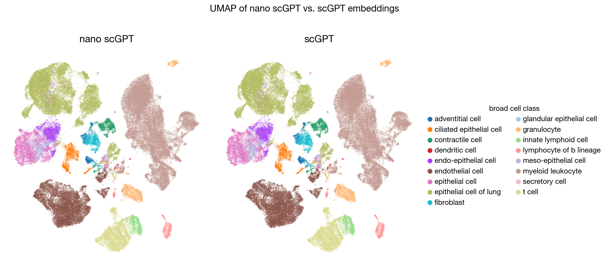

# nano-scGPT

nano-scGPT is a minimal, fast, and faithful implementation of [scGPT](https://github.com/bowang-lab/scGPT) for single-cell foundation model inference. `nano_scgpt/model.py` provides a lightweight PyTorch implementation of the scGPT architecture, while `nano_scgpt/scGPT_tokenizer.py` converts single-cell expression data into model inputs. nano-scGPT is part of [nano-scFMs](https://github.com/huynguyen250896/nano-scFMs), a collection of lightweight PyTorch implementations of single-cell foundation models.



nano-scGPT aims to provide:
- A clean and minimal implementation
- Faithful reproduction of the original scGPT architecture
- Faster inference with modern PyTorch optimizations
- A codebase suitable for experimentation and future extension

## Benchmark

nano-scGPT produces cell embeddings numerically equivalent to the original scGPT implementation while providing faster inference.

### Inference Performance

nano-scGPT achieves **1.38× faster inference** using a lightweight forward pass together with `torch.compile`.

| Model | Total (65,847 cells) | Per cell | Throughput | Speedup |
| --- | ---: | ---: | ---: | ---: |
| **nano-scGPT** | **77.7 s** | **1.18 ms** | **847 cells/s** | **1.38×** |
| scGPT | 107.0 s | 1.63 ms | 615 cells/s | 1.00× |

> Benchmarked on a single NVIDIA A100 GPU with batch size 256, AMP autocast, 10 batch warmup, and the Tabula Sapiens lung dataset containing 65,847 cells.

### Cell-level Embedding Reproducibility

nano-scGPT reproduces the original scGPT embedding space to near numerical precision.

The pretrained model preserves the original scGPT gene-identity embeddings, continuous expression-value encoding, Transformer architecture, and `<cls>`-based cell representation while using a lightweight PyTorch implementation for inference.

## Install

Clone the repository and install the Python dependencies.

```bash
git clone https://github.com/huynguyen250896/nano-scGPT.git
cd nano-scGPT
```

### Option A: using uv

```bash
uv sync
source .venv/bin/activate
```

### Option B: using pip

```bash
python -m venv .venv
source .venv/bin/activate
pip install -e .
```

## Quick Start

### Using nano-scGPT in Python

```python
import numpy as np

from nano_scgpt.scGPT_tokenizer import scGPTTokenizer
from nano_scgpt.model import scGPTModel

# Load the pretrained scGPT model.
model = scGPTModel.from_pretrained("scGPT_human")
model.eval()

# Load the scGPT tokenizer.
tokenizer = scGPTTokenizer.from_pretrained("scGPT_human")

# Example gene-expression matrix.
genes = [
    "DUX4L30",
    "CTB-52I2.4",
    "USP17L16P",
    "RPL7P23",
]

exprs = np.array(
    [
        [1.0, 0.0, 23.0, 6.0],
        [0.0, 0.0, 3.0, 7.0],
    ]
)

# Convert expression data into scGPT model inputs.
encoded = tokenizer.encode(exprs, genes)

# Extract pretrained cell embeddings.
embeddings = model.encode(
    encoded["gene_ids"],
    encoded["exprs"],
    encoded["padding_mask"],
)

print(embeddings.shape)
```

### Generate Cell Embeddings from `.h5ad`

```bash
python tasks/embedding.py \
    --input <path-to-input.h5ad> \
    --output scGPT_embeddings.npy
```

The embedding pipeline performs gene-vocabulary alignment, expression preprocessing, scGPT tokenization, pretrained model inference, and cell-level representation extraction.

A different batch size can be specified with:

```bash
python tasks/embedding.py \
    --input <path-to-input.h5ad> \
    --output scGPT_embeddings.npy \
    --batch_size 256
```

The resulting embeddings are saved as a NumPy array with shape:

```text
(number_of_cells, embedding_dimension)
```

## Roadmap

- [x] Embedding `.h5ad` single-cell RNA-seq data with scGPT
- [ ] Fine-tuning for downstream single-cell tasks
- [ ] Training from scratch

Let me know what tasks you'd like to see next!

## Acknowledgments

1. If you find this repository useful and/or use nano-scGPT in your work, please cite the original scGPT paper:

> H. Cui, C. Wang, H. Maan, K. Pang, F. Luo, N. Duan, and B. Wang. scGPT: toward building a foundation model for single-cell multi-omics using generative AI. *Nature Methods* 21, 1470–1480 (2024).

2. nano-scGPT is inspired by Andrej Karpathy's [nanoGPT](https://github.com/karpathy/nanoGPT) and Chris Hayduk's [minAlphaFold2](https://github.com/ChrisHayduk/minAlphaFold2).

3. This repository is adapted from Danqi Liao's [nano-scGPT](https://github.com/Danqi7/nano-scGPT).

## License

[MIT LICENSE](LICENSE)